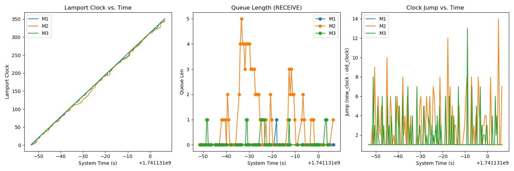

# Analysis Summary

## Summary Table

|   machine_id |   clock_rate |   final_clock |   avg_jump_size |   max_queue_len |
|-------------:|-------------:|--------------:|----------------:|----------------:|
|            1 |            6 |           351 |         1       |               1 |
|            2 |            2 |           349 |         2.93277 |               5 |
|            3 |            3 |           344 |         1.93258 |               1 |

**Final Drift (max - min final_clock)**: 7.0

## Observations
- Here you can add your own notes or automated observations.
- For instance, check if the drift is large or small.
- Compare average jump sizes across machines.
- Check if max queue length indicates any backlog.

## Plot

